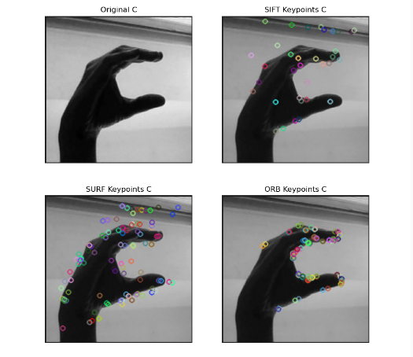

# A Sure Sign

Hand sign recognition for EECS 351

A Sure Sign compares several featurization methods' performance in classifying ASL hand gestures. A simplified architecture of the application can be seen below:


## Featurization

A Sure Sign supports several featurization methods for images.

1. *Downsampling* - This method simply downsamples the greyscale image to a more reasonable size (say 20x20 pixels) and flattens the result to a 1-dimensional feature vector.
2. *FFT* - An N-point Fast Fourier Transform is applied to the image. N can be specified and is used to reduce the dimensionality of the data. N is a tuple such as `(20, 20)` specifying the size of each dimension of the resulting image after FFT. The FFT result is then flattened as in the _downsampling_ method.
3. *DWT* - A level N wavelet decomposition is performed on the image using a specified wavelet. The level and wavelet can be spcified. For example, we have used a level 3 decomposition with the Haar wavelet to some success. We use the flattened approximation generated by the level N decomposition as a feature.
4. *Keypoint Featurizers* - Several keypoint featurizers such as SIFT and SURF are used in conjunction with K Means to generate features. The keypoint featurizer generates several keypoints and corresponding descriptors for each image. we use K Means to cluster these descriptors into N groups. The descriptors then vote on each of the N elements of the feature vector for their corresponding image. More information on how this is done can be found in [ft_kmeans.py](src/features/ft_kmeans.py). The following keypoint featurizers are supported, they are all implemented by OpenCV. SIFT and SURF require OpenCV to be built from source with non-free contrib modules enabled.
   1. SIFT - Scale Invariant Feature Transform
   2. SURF - Speeded Up Robust Features
   3. ORB - Oriented FAST and Rotated BRIEF

The following image shows an example of the kinds of keypoints SIFT, SURF, and ORB extract:



## Classification

A Sure Sign uses the AdaBoost ensemble classifier with decision trees to classify the featurized images. The features calculated by the featurizer go directly to the classifier without any further processing. We are classifying 29 classes: 26 letters of the English alphabet, `space`, `del`, and `nothing`.

## Dataset

A Sure Sign was trained using the ASL alphabet dataset on Kaggle found [here](https://www.kaggle.com/grassknoted/asl-alphabet). You can download the dataset using `download_dataset.py`. Keep in mind, Kaggle datasets require you to authenticate using a Kaggle account. More information can be found in `download_dataset.py` on how to do this.

## Results

The table below shows cross validation and test results for each featurization method. All methods used the AdaBoost classifier with the same hyperparameters (max tree depth of 3 and 1000 estimators). The result shown is the mean score across all folds of 10-fold cross validation with 87,000 training examples (3,000 per class). The score for each fold is the subset accuracy, which is a harsh metric. We used a small dataset of 29 images, one for each class, to test the trained classifier. The results shown below are the percentage of correctly identified examples.

Simply downsampling performed surprisingly well. ORB performed much worse than we expected. SIFT, DWT, and SURF performed the best. Since we have a 29 class dataset, we expect simply guessing to yield an accuracy of 3.4%. All of the featurization methods performed far better than that.

| Method       | 10-fold cross validation | Test   |
| ------------ | ------------------------ | ------ |
| Downsampling | 69.5%                    | 71.4%  |
| FFT          | 50.0%                    | 60.7 % |
| DWT          | 76.9%                    | 75.0%  |
| ORB          | 31.7%                    | 25.0%  |
| SIFT         | 67.6%                    | 85.7%  |
| SURF         | 76.1%                    | 89.3%  |


## Requirements

It is recommended to use a virtrual environment for this application.

All requirements that can be installed using `pip` are listed in `requirements.txt`. Simply run

```bash
pip install -r requirements.txt
```

A Sure Sign uses SIFT and SURF which are non-free modules of OpenCV and cannot be distributed as binaries. Running the `install_opencv.sh` script will clone, build, and install the correct version of OpenCV with the non-free modules. If using a virtualenvironment, the script tries to create a symbolic link between the global install of OpenCV and the virtualenvironment, but depending on your situation you may need to do this yourself. Generally, this command will suffice:

```bash
    ln -s "/usr/local/lib/python3.8/site-packages/cv2" "env/lib/python3.8/site-packages/cv2"
```

You will need to replace `python3.8` with your python version and `env` with your virtualenvironment directory.

If you are not using a virtualenvironment, the clobal installation of OpenCV will work fine.

## How to run

```bash
python app.py
```

You can take a screenshot of the app window using the `y` key and you can quit using `q`.

## Configuration

The project can be configured using `config.yaml`. Most options are pretty self explanatory. You can specify the location of the pickled models if you have already trained the ML models. All locations are relative to the location of the python script you run (e.g. `app.py`).

When models are trained, their pickle files are saved in the `checkpoints` directory. Keep in mind, we have featurizers *and* classifiers that are saved as pickles. Do not mix them up. If you got a version of this repository with pre-trained models, then the pickle files are already organized for you. Within the `checkpoint` direcotry, you will find subdirectories named `sift`, `surf`, etc.

If you want to run the app using the SURF featurizer for example, make sure you specify the following:

```yaml
featurizers.featurizer: "surf"
featurizers.surf.pickle: "checkpoints/surf/surf_pickle.z"
classification.adaboost.pickle: "checkpoints/surf/adaboost_pickle.z"
```

## Training
To train the AdaBoost classifier using any of the featurizers, `train.py` may be used. Make sure to properly configure where you want the pickle files to be saved. Training tries to use most available resources on your computer, but it can take several hours depending on the speed of your computer.

## Examples


